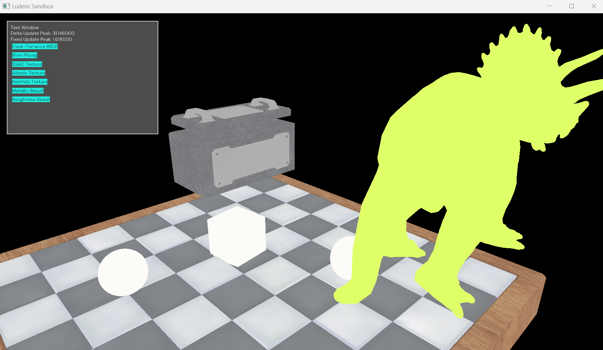
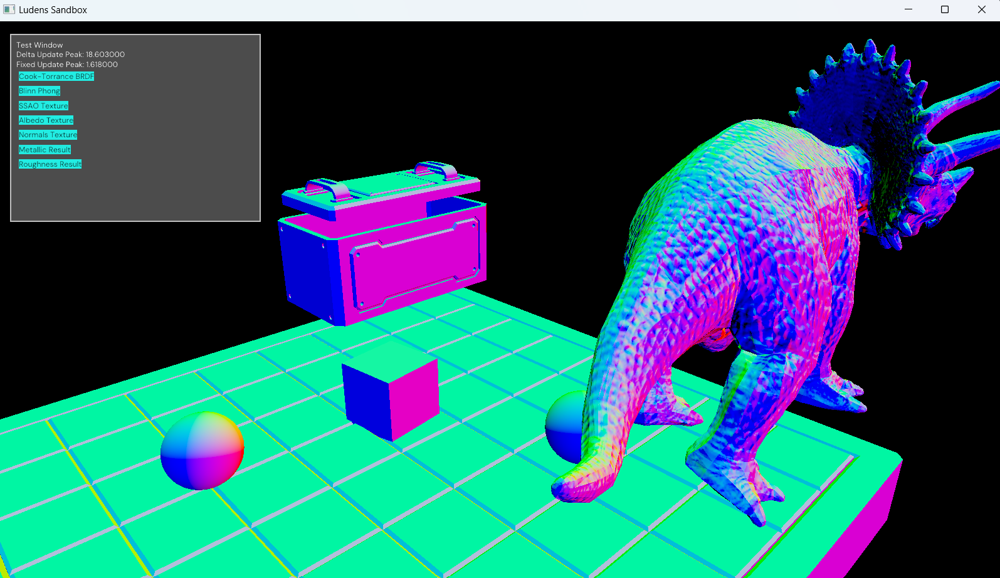
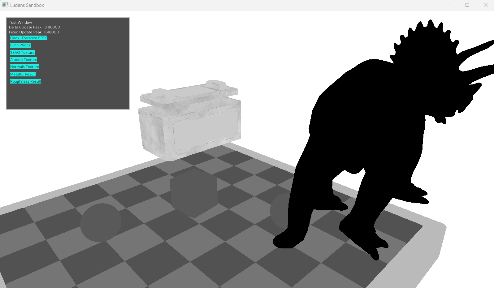
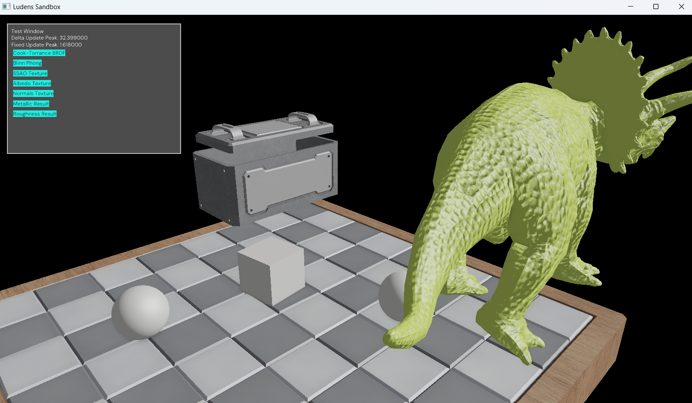

# Ludens Framework

A modular game development framework.

## Archival Notice

This is my first attempt on a game engine / framework design, the codebase
is archived after approxiamtely one year of development since `2024/01/01`.
This is a snapshot of the last commit.

## Codebase Structure

Core Modules

- IO: filesystem manipulation
- OS: synchronization primitives and a custom thread-based Job System.
- Math: low-order linear algebra, quaternions, etc.
- DSA: basic templated data structures
- Application: application framework, on top of GLFW
- Serialize: serialization of `.xml`, `.ini` etc
- UI: custom user interface library
- Scene: the basic unit of simulation in an ECS fasion

Rendering Modules

- RenderBase: graphics API abstraction for OpenGL and Vulkan
- RenderFX: prefab graphics pipelines, render passes, and resources
- RenderService: high-level rendering API, used by `Scene` module

Physics Modules

- PhysicsBase: integration of the [Jolt](https://github.com/jrouwe/JoltPhysics) physics engine with Ludens Job System.
- PhysicsService: high-level physics API, used by `Scene` module

## Embedded Data

The framework uses `Scripts/Embed.py` to embed SPIRV shaders and TTF fonts directly into the binary. This is automated
by the build system with CMake functions. The raw data resides in `Embed/Fonts` and `Embed/GLSL`.

Using SPIRV-Cross and GLSlang, the shader source code is transpiled to GLSL for Vulkan or OpenGL, and finally compiled
to SPIRV before being directly embedded in the binary.

## Screenshots

Screenshots from an external sandbox application simulating a Ludens scene.

Deferred Albedo Colors

Deferred View Space Normals

Deferred Roughness Values

Scene Blinn Phong Shading

## License

MIT